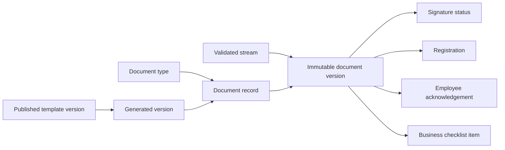

# Document model

Document types configure MIME/size/confidentiality policy. Templates and document records have
immutable versions; signing and registration never overwrite stored content. Checklist items bind
required document types and a validated document version to a hiring or termination business ID.

Uploads sanitize leaf filenames, prevent traversal, stream with a hard size limit, validate MIME,
calculate SHA-256 and use local/S3 storage ports. Sensitive downloads require a distinct permission.
Development manual signatures carry `manualConfirmation=true`; they are disabled outside
development and are not presented as provider signatures. The local generator only renders UTF-8
scalar placeholders; binary office rendering is a future adapter.

Seeded types cover recruitment requests, CV/consent/evaluations/offers, hiring contract/order and
the termination request/notice/legal/order/handover/assets/access/settlement/exit-interview set.
