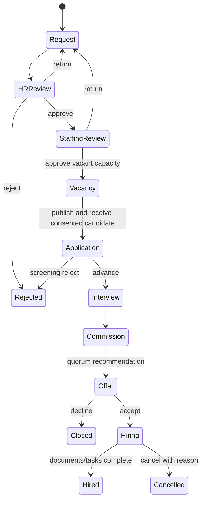

# Recruitment and hiring

Recruitment selects an accepted candidate; formal hiring is a separate transactional case.

The request and hiring assignment use authoritative organization, unit, position, published
structure and staffing-slot capacity. Evaluations are immutable per evaluator; commission decisions
require configured quorum/conflict declarations. Completion locks capacity, prevents duplicate
employee numbers and atomically creates Person, Employee and primary Assignment, then fills the
vacancy. Incomplete mandatory checklist/onboarding work blocks completion.

Email, phone and identity data are encrypted at rest and redacted from generic output, audit and
outbox. Consent is mandatory. Expired records may be anonymized only without active applications.
External publication is explicitly recorded as manual until a job-board adapter exists.
