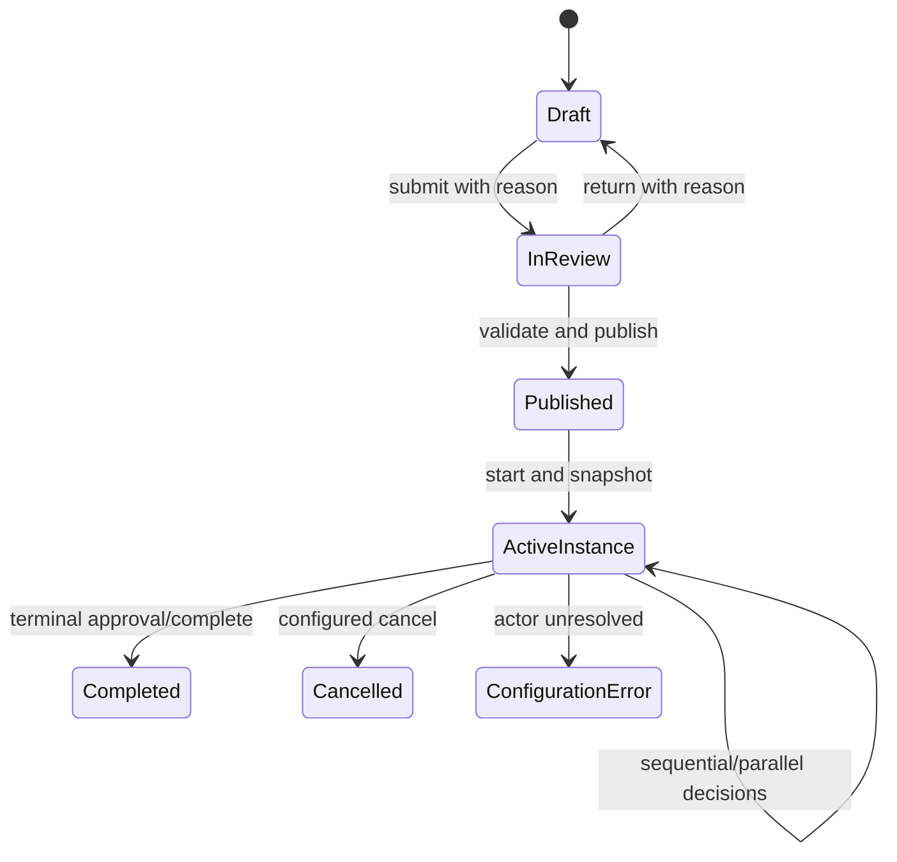

# Workflow architecture

The workflow module is a local, transactional runtime—not a universal low-code engine. Definitions,
actor rules, steps and transitions are edited in drafts and become immutable after publication.
Instances store the complete published version snapshot and never follow later edits.

Actors resolve from the initiator, subject employee's active user, explicit active users,
commission users in context, or active permission holders within the instance organization.
Reassignment additionally requires an effective, unrevoked delegation containing
`workflow.task.act`. An unresolved actor persists `configuration_error` and an audit record.

Conditions are JSON declarations supporting boolean composition, existence, equality, membership
and ordered comparisons. Arbitrary scripts, SQL and expression evaluation are rejected. Task
actions use revision checks and idempotency keys. Return, reject and cancel require reasons.

Initial routes and operational limitations are documented in [Module 2](MODULE2_WORKFLOWS.md).
